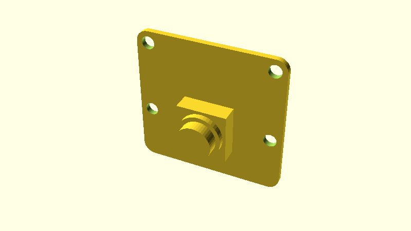

# OpenSCAD RPi Camera

An OpenSCAD model of the Raspberry Pi Camera v2.1. At the moment it is a quick model to be used with other OpenSCAD/git projects as a submodule.

## License

This work is licensed under CC0 1.0 Universal (CC0 1.0) Public Domain Dedication license.
